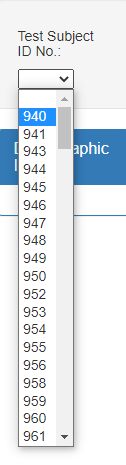
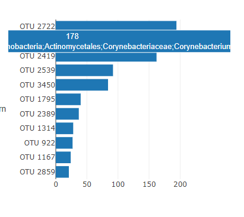
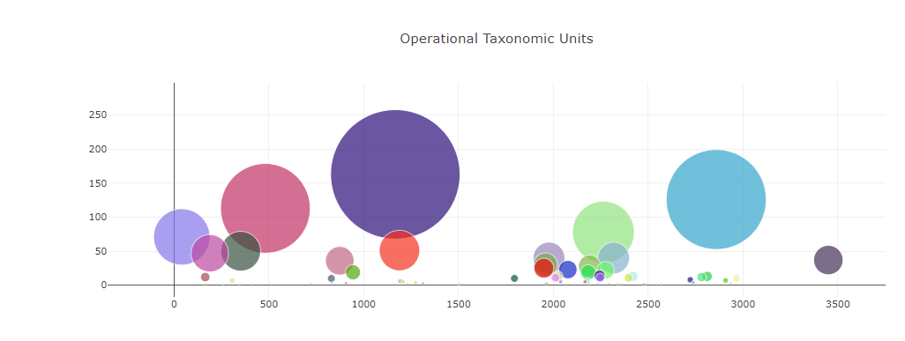
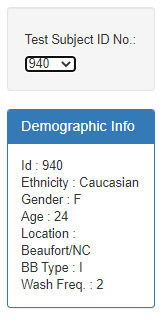
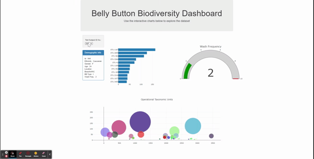
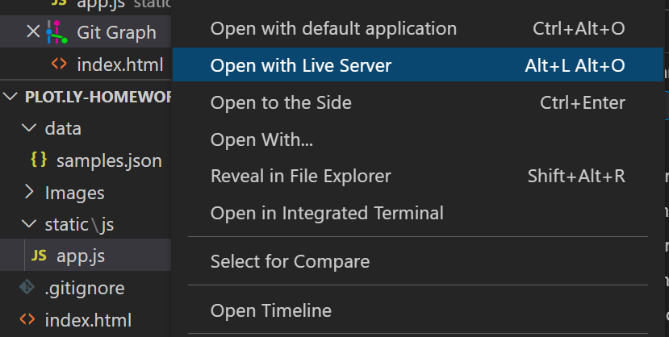
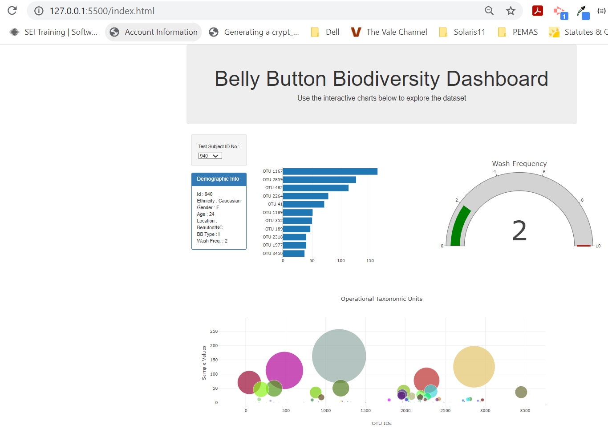

# Plot.ly Homework - Belly Button Biodiversity

In this assignment, you will build an interactive dashboard to explore the [Belly Button Biodiversity dataset](http://robdunnlab.com/projects/belly-button-biodiversity/), which catalogs the microbes that colonize human navels.

The dataset reveals that a small handful of microbial species (also called operational taxonomic units, or OTUs, in the study) were present in more than 70% of people, while the rest were relatively rare.

##  Plotly

1. The D3 Library was used to read in the [`samples.json`](./data/samples.json) file.

2. The first chart is a horizontal bar chart to display the top 10 OTUs found for a particular individual.  The individual's identifier can be selected from a drop down list.

   

* The bar heights are provided by the `sample_values` array.

* The labels for the bar chart are provided by the `otu_ids` array.

* The hovertext is provided by the `otu_labels` array.

3. The second chart is a bubble chart that displays each sample, using:

* `otu_ids` for the x values (horizontal axis).

* `sample_values` for the y values (vertical axes).

* `sample_values` for the marker size (circle size).

* `otu_ids` for the marker colors, the color are generated randomly.

* `otu_labels` for the text values (hovertext).

4. The individual's demographic information is displayed on a panel (card element):

6. All of the plots are updated any time that a new sample id is selected from the list of values:

### About the Data

Hulcr, J. et al.(2012) _A Jungle in There: Bacteria in Belly Buttons are Highly Diverse, but Predictable_. Retrieved from: [http://robdunnlab.com/projects/belly-button-biodiversity/results-and-data/](http://robdunnlab.com/projects/belly-button-biodiversity/results-and-data/)

### How to install the program.

* Clone the [github repo](https://github.com/j0serobles/plot.ly-homework) to your local machine.

* Open the project with VSCode.

* Right click in the index.html file and select "Open with Live Server".  This will activate the HTTP Server at its default port 5500.

* The Web page with the dashboard should be displayed:

- - -

© 2021 Trilogy Education Services, LLC, a 2U, Inc. brand. Confidential and Proprietary. All Rights Reserved.
